# AI-CROS — AI-Powered Ethiopian Cafe & Restaurant Operating System
## Architecture Documentation Package v1.0

**Prepared for:** Investor review, engineering onboarding, and production deployment planning
**Document type:** Enterprise Solution Architecture
**Diagram notation:** C4 Model, Mermaid.js (importable into Draw.io — see instructions below)

---

## How to use this document

Every diagram below is written in **Mermaid syntax**. To edit, re-style, or export as a `.drawio` file:

1. Open [draw.io](https://app.diagrams.net) → **Extras → Edit Diagram**.
2. Paste the contents of the matching `.mmd` file from the `/diagrams` folder.
3. Draw.io will render it as an editable native diagram — regroup, recolor, or add your own icon libraries (Azure / AWS shapes) from the left panel.
4. Alternatively, paste into [mermaid.live](https://mermaid.live) for a quick preview/export to SVG/PNG first.

**Color legend used throughout:**

| Color | Meaning |
|---|---|
| 🔵 Azure Blue (`#0078D4`) | Client / Frontend layer |
| 🩵 Cyan (`#00BCF2`) | API Gateway / Controllers |
| 🟣 Purple (`#5C2D91`) | Backend services / business logic |
| 🟢 Teal (`#008272`) | Databases / data stores |
| 🟠 Orange (`#FF9900`) | AI / ML components (AWS-style accent) |
| 🔷 Deep Blue (`#0063B1`) | Cloud infrastructure |
| 🔴 Red (`#D13438`) | Security controls |
| ⚪ Gray (`#767676` / `#7A7574`) | External systems / monitoring |
| ⚫ Black (`#1B1A19`) | Human actors (users) |

---

## Table of Contents

1. C4 Model (Context, Container, Component, Code)
2. High-Level System Architecture
3. Client Architecture
4. Backend Architecture
5. Authentication Architecture
6. Database Architecture (ERD)
7. Microservice Architecture
8. Payment Architecture
9. AI Architecture
10. RAG Architecture
11. Machine Learning Architecture (MLOps)
12. Data Engineering Architecture
13. DevOps Architecture (CI/CD)
14. Deployment Diagram
15. Network Architecture
16. Security Architecture
17. Sequence Diagrams (10 flows)
18. Data Flow Diagrams (8 flows)
19. Monitoring Architecture
20. Cloud Architecture
21. Responsibility Matrix
22. Complete End-to-End Data Flow

---

## 1.1 C4 Model — System Context Diagram

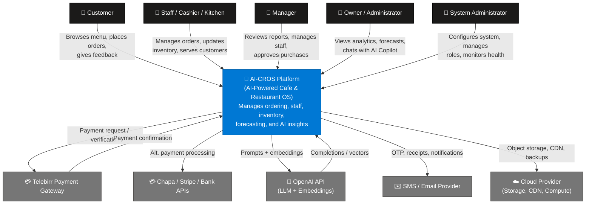
```mermaid
%% C4 MODEL — LEVEL 1: SYSTEM CONTEXT DIAGRAM
%% AI-CROS — AI-Powered Ethiopian Cafe & Restaurant Operating System
flowchart TB
    classDef person fill:#1B1A19,color:#fff,stroke:#000
    classDef system fill:#0078D4,color:#fff,stroke:#005A9E
    classDef external fill:#767676,color:#fff,stroke:#4C4A48

    Customer["👤 Customer"]:::person
    Staff["👤 Staff / Cashier / Kitchen"]:::person
    Manager["👤 Manager"]:::person
    Owner["👤 Owner / Administrator"]:::person
    SysAdmin["👤 System Administrator"]:::person

    AICROS["🏢 AI-CROS Platform\n(AI-Powered Cafe & Restaurant OS)\nManages ordering, staff, inventory,\nforecasting, and AI insights"]:::system

    Telebirr["💳 Telebirr Payment Gateway"]:::external
    Chapa["💳 Chapa / Stripe / Bank APIs"]:::external
    OpenAI["🤖 OpenAI API\n(LLM + Embeddings)"]:::external
    SMS["✉️ SMS / Email Provider"]:::external
    Cloud["☁️ Cloud Provider\n(Storage, CDN, Compute)"]:::external

    Customer -->|"Browses menu, places orders,\ngives feedback"| AICROS
    Staff -->|"Manages orders, updates\ninventory, serves customers"| AICROS
    Manager -->|"Reviews reports, manages staff,\napproves purchases"| AICROS
    Owner -->|"Views analytics, forecasts,\nchats with AI Copilot"| AICROS
    SysAdmin -->|"Configures system, manages\nroles, monitors health"| AICROS

    AICROS -->|"Payment request / verification"| Telebirr
    AICROS -->|"Alt. payment processing"| Chapa
    AICROS -->|"Prompts + embeddings"| OpenAI
    AICROS -->|"OTP, receipts, notifications"| SMS
    AICROS -->|"Object storage, CDN, backups"| Cloud

    Telebirr -->|"Payment confirmation"| AICROS
    OpenAI -->|"Completions / vectors"| AICROS
```

---

## 1.2 C4 Model — Container Diagram

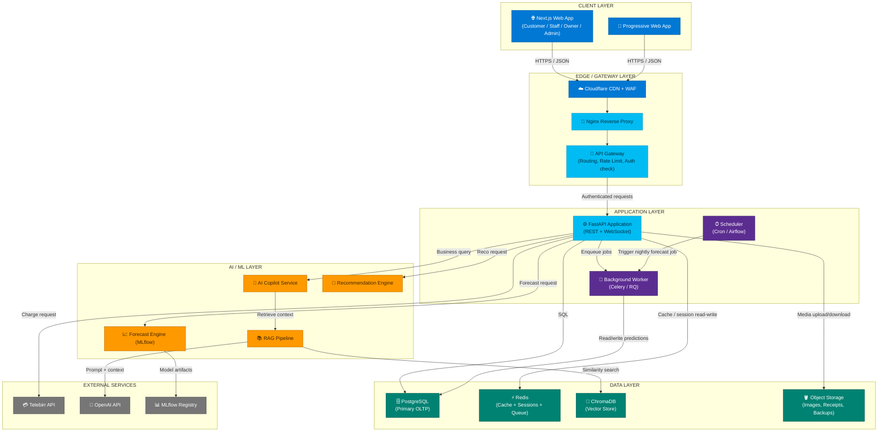
```mermaid
%% C4 MODEL — LEVEL 2: CONTAINER DIAGRAM
flowchart TB
    classDef client fill:#0078D4,color:#fff,stroke:#005A9E
    classDef api fill:#00BCF2,color:#062B3E,stroke:#008DBF
    classDef service fill:#5C2D91,color:#fff,stroke:#3B1E63
    classDef data fill:#008272,color:#fff,stroke:#00564C
    classDef ai fill:#FF9900,color:#3B2400,stroke:#B36B00
    classDef external fill:#767676,color:#fff,stroke:#4C4A48

    subgraph CLIENTS["CLIENT LAYER"]
        WebApp["🌐 Next.js Web App\n(Customer / Staff / Owner / Admin)"]:::client
        PWA["📱 Progressive Web App"]:::client
    end

    subgraph EDGE["EDGE / GATEWAY LAYER"]
        CF["☁️ Cloudflare CDN + WAF"]:::client
        Nginx["🚪 Nginx Reverse Proxy"]:::api
        Gateway["🔀 API Gateway\n(Routing, Rate Limit, Auth check)"]:::api
    end

    subgraph BACKEND["APPLICATION LAYER"]
        FastAPI["⚙️ FastAPI Application\n(REST + WebSocket)"]:::api
        Worker["🔁 Background Worker\n(Celery / RQ)"]:::service
        Scheduler["⏱ Scheduler\n(Cron / Airflow)"]:::service
    end

    subgraph AISVC["AI / ML LAYER"]
        Copilot["🤖 AI Copilot Service"]:::ai
        Forecast["📈 Forecast Engine (MLflow)"]:::ai
        RecoEngine["🎯 Recommendation Engine"]:::ai
        RAG["📚 RAG Pipeline"]:::ai
    end

    subgraph DATASTORES["DATA LAYER"]
        Postgres["🗄 PostgreSQL\n(Primary OLTP)"]:::data
        Redis["⚡ Redis\n(Cache + Sessions + Queue)"]:::data
        Chroma["🧠 ChromaDB\n(Vector Store)"]:::data
        S3["🪣 Object Storage\n(Images, Receipts, Backups)"]:::data
    end

    subgraph EXTERNALS["EXTERNAL SERVICES"]
        Telebirr["💳 Telebirr API"]:::external
        OpenAI["🤖 OpenAI API"]:::external
        MLflowUI["📊 MLflow Registry"]:::external
    end

    WebApp -->|"HTTPS / JSON"| CF --> Nginx --> Gateway
    PWA -->|"HTTPS / JSON"| CF
    Gateway -->|"Authenticated requests"| FastAPI
    FastAPI -->|"SQL"| Postgres
    FastAPI -->|"Cache / session read-write"| Redis
    FastAPI -->|"Enqueue jobs"| Worker
    Scheduler -->|"Trigger nightly forecast job"| Worker
    Worker -->|"Read/write predictions"| Postgres
    FastAPI -->|"Business query"| Copilot
    Copilot -->|"Retrieve context"| RAG
    RAG -->|"Similarity search"| Chroma
    RAG -->|"Prompt + context"| OpenAI
    FastAPI -->|"Forecast request"| Forecast
    Forecast -->|"Model artifacts"| MLflowUI
    FastAPI -->|"Reco request"| RecoEngine
    FastAPI -->|"Charge request"| Telebirr
    FastAPI -->|"Media upload/download"| S3
```

---

## 1.3 C4 Model — Component Diagram

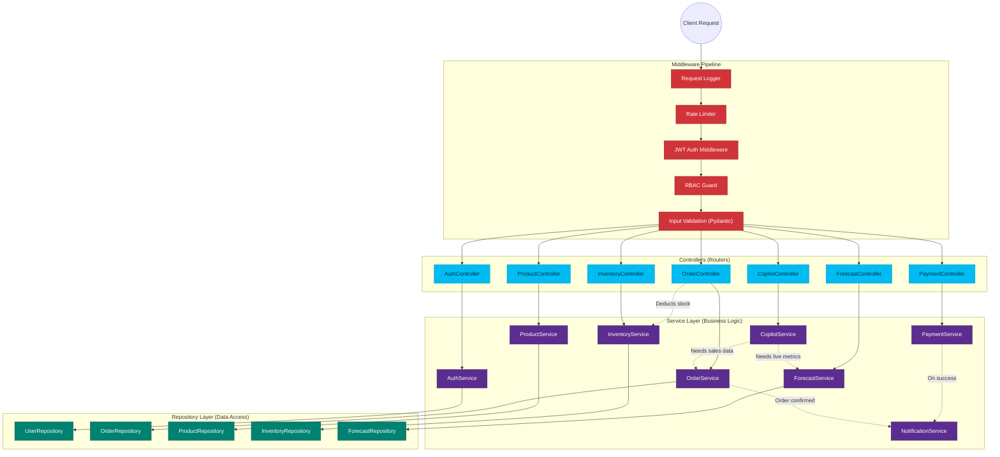
```mermaid
%% C4 MODEL — LEVEL 3: COMPONENT DIAGRAM (inside FastAPI Application container)
flowchart TB
    classDef ctrl fill:#00BCF2,color:#062B3E,stroke:#008DBF
    classDef svc fill:#5C2D91,color:#fff,stroke:#3B1E63
    classDef repo fill:#008272,color:#fff,stroke:#00564C
    classDef mid fill:#D13438,color:#fff,stroke:#8E2226

    subgraph MIDDLEWARE["Middleware Pipeline"]
        M1["Request Logger"]:::mid
        M2["Rate Limiter"]:::mid
        M3["JWT Auth Middleware"]:::mid
        M4["RBAC Guard"]:::mid
        M5["Input Validation (Pydantic)"]:::mid
    end

    subgraph CONTROLLERS["Controllers (Routers)"]
        C1["AuthController"]:::ctrl
        C2["OrderController"]:::ctrl
        C3["ProductController"]:::ctrl
        C4["InventoryController"]:::ctrl
        C5["ForecastController"]:::ctrl
        C6["CopilotController"]:::ctrl
        C7["PaymentController"]:::ctrl
    end

    subgraph SERVICES["Service Layer (Business Logic)"]
        S1["AuthService"]:::svc
        S2["OrderService"]:::svc
        S3["ProductService"]:::svc
        S4["InventoryService"]:::svc
        S5["ForecastService"]:::svc
        S6["CopilotService"]:::svc
        S7["PaymentService"]:::svc
        S8["NotificationService"]:::svc
    end

    subgraph REPOS["Repository Layer (Data Access)"]
        R1["UserRepository"]:::repo
        R2["OrderRepository"]:::repo
        R3["ProductRepository"]:::repo
        R4["InventoryRepository"]:::repo
        R5["ForecastRepository"]:::repo
    end

    Client((Client Request)) --> M1 --> M2 --> M3 --> M4 --> M5
    M5 --> C1 & C2 & C3 & C4 & C5 & C6 & C7
    C1 --> S1 --> R1
    C2 --> S2 --> R2
    C2 -.->|"Deducts stock"| S4
    C3 --> S3 --> R3
    C4 --> S4 --> R4
    C5 --> S5 --> R5
    C6 --> S6
    S6 -.->|"Needs live metrics"| S5
    S6 -.->|"Needs sales data"| S2
    C7 --> S7 -.->|"On success"| S8
    S2 -.->|"Order confirmed"| S8
```

---

## 1.4 C4 Model — Code-Level Diagram

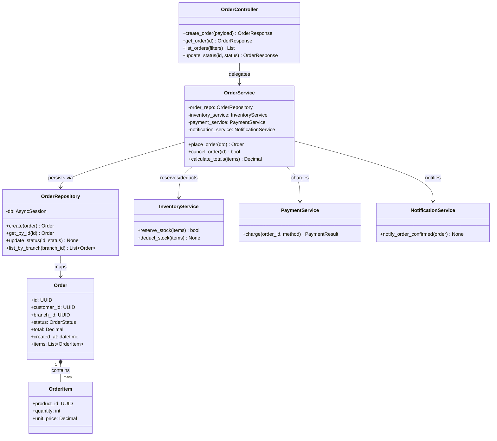
```mermaid
%% C4 MODEL — LEVEL 4: CODE-LEVEL DIAGRAM (OrderService example, class relationships)
classDiagram
    class OrderController {
        +create_order(payload) OrderResponse
        +get_order(id) OrderResponse
        +list_orders(filters) List
        +update_status(id, status) OrderResponse
    }
    class OrderService {
        -order_repo: OrderRepository
        -inventory_service: InventoryService
        -payment_service: PaymentService
        -notification_service: NotificationService
        +place_order(dto) Order
        +cancel_order(id) bool
        +calculate_totals(items) Decimal
    }
    class OrderRepository {
        -db: AsyncSession
        +create(order) Order
        +get_by_id(id) Order
        +update_status(id, status) None
        +list_by_branch(branch_id) List~Order~
    }
    class Order {
        +id: UUID
        +customer_id: UUID
        +branch_id: UUID
        +status: OrderStatus
        +total: Decimal
        +created_at: datetime
        +items: List~OrderItem~
    }
    class OrderItem {
        +product_id: UUID
        +quantity: int
        +unit_price: Decimal
    }
    class InventoryService {
        +reserve_stock(items) bool
        +deduct_stock(items) None
    }
    class PaymentService {
        +charge(order_id, method) PaymentResult
    }
    class NotificationService {
        +notify_order_confirmed(order) None
    }

    OrderController --> OrderService : delegates
    OrderService --> OrderRepository : persists via
    OrderService --> InventoryService : reserves/deducts
    OrderService --> PaymentService : charges
    OrderService --> NotificationService : notifies
    OrderRepository --> Order : maps
    Order "1" *-- "many" OrderItem : contains
```

---

## 2. High-Level System Architecture

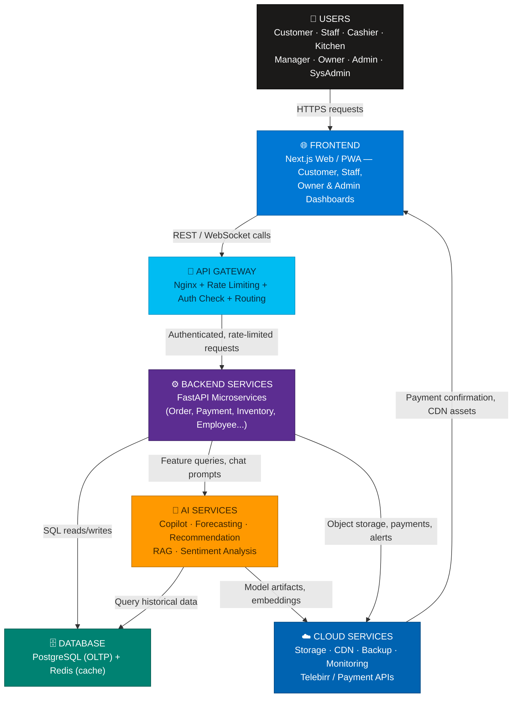
```mermaid
%% HIGH-LEVEL SYSTEM ARCHITECTURE
flowchart TB
    classDef users fill:#1B1A19,color:#fff,stroke:#000
    classDef fe fill:#0078D4,color:#fff,stroke:#005A9E
    classDef gw fill:#00BCF2,color:#062B3E,stroke:#008DBF
    classDef be fill:#5C2D91,color:#fff,stroke:#3B1E63
    classDef db fill:#008272,color:#fff,stroke:#00564C
    classDef ai fill:#FF9900,color:#3B2400,stroke:#B36B00
    classDef cloud fill:#0063B1,color:#fff,stroke:#00457C

    U["👤 USERS\nCustomer · Staff · Cashier · Kitchen\nManager · Owner · Admin · SysAdmin"]:::users
    FE["🌐 FRONTEND\nNext.js Web / PWA — Customer, Staff,\nOwner & Admin Dashboards"]:::fe
    GW["🚪 API GATEWAY\nNginx + Rate Limiting + Auth Check + Routing"]:::gw
    BE["⚙️ BACKEND SERVICES\nFastAPI Microservices\n(Order, Payment, Inventory, Employee...)"]:::be
    DB["🗄 DATABASE\nPostgreSQL (OLTP) + Redis (cache)"]:::db
    AI["🤖 AI SERVICES\nCopilot · Forecasting · Recommendation\nRAG · Sentiment Analysis"]:::ai
    CLOUD["☁️ CLOUD SERVICES\nStorage · CDN · Backup · Monitoring\nTelebirr / Payment APIs"]:::cloud

    U -->|"HTTPS requests"| FE
    FE -->|"REST / WebSocket calls"| GW
    GW -->|"Authenticated, rate-limited requests"| BE
    BE -->|"SQL reads/writes"| DB
    BE -->|"Feature queries, chat prompts"| AI
    AI -->|"Query historical data"| DB
    BE -->|"Object storage, payments, alerts"| CLOUD
    AI -->|"Model artifacts, embeddings"| CLOUD
    CLOUD -->|"Payment confirmation, CDN assets"| FE
```

---

## 3. Client Architecture

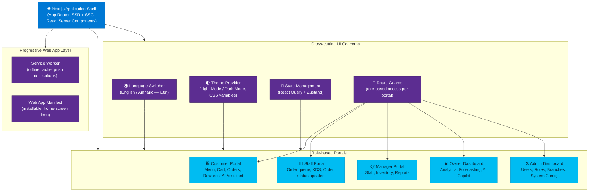
```mermaid
%% CLIENT ARCHITECTURE
flowchart TB
    classDef shell fill:#0078D4,color:#fff,stroke:#005A9E
    classDef portal fill:#00BCF2,color:#062B3E,stroke:#008DBF
    classDef util fill:#5C2D91,color:#fff,stroke:#3B1E63

    NextApp["🌐 Next.js Application Shell\n(App Router, SSR + SSG, React Server Components)"]:::shell

    subgraph PWA_LAYER["Progressive Web App Layer"]
        SW["Service Worker\n(offline cache, push notifications)"]:::util
        Manifest["Web App Manifest\n(installable, home-screen icon)"]:::util
    end

    subgraph PORTALS["Role-based Portals"]
        CustomerPortal["🛍 Customer Portal\nMenu, Cart, Orders, Rewards, AI Assistant"]:::portal
        StaffPortal["🧑‍🍳 Staff Portal\nOrder queue, KDS, Order status updates"]:::portal
        ManagerPortal["📋 Manager Portal\nStaff, Inventory, Reports"]:::portal
        OwnerPortal["📊 Owner Dashboard\nAnalytics, Forecasting, AI Copilot"]:::portal
        AdminPortal["🛠 Admin Dashboard\nUsers, Roles, Branches, System Config"]:::portal
    end

    subgraph CROSSCUTTING["Cross-cutting UI Concerns"]
        LangSwitch["🌍 Language Switcher\n(English / Amharic — i18n)"]:::util
        ThemeSwitch["🌓 Theme Provider\n(Light Mode / Dark Mode, CSS variables)"]:::util
        StateMgr["🔄 State Management\n(React Query + Zustand)"]:::util
        AuthGuard["🔐 Route Guards\n(role-based access per portal)"]:::util
    end

    NextApp --> PWA_LAYER
    NextApp --> PORTALS
    NextApp --> CROSSCUTTING
    AuthGuard --> CustomerPortal & StaffPortal & ManagerPortal & OwnerPortal & AdminPortal
    LangSwitch --> PORTALS
    ThemeSwitch --> PORTALS
    StateMgr --> PORTALS
```

---

## 4. Backend Architecture

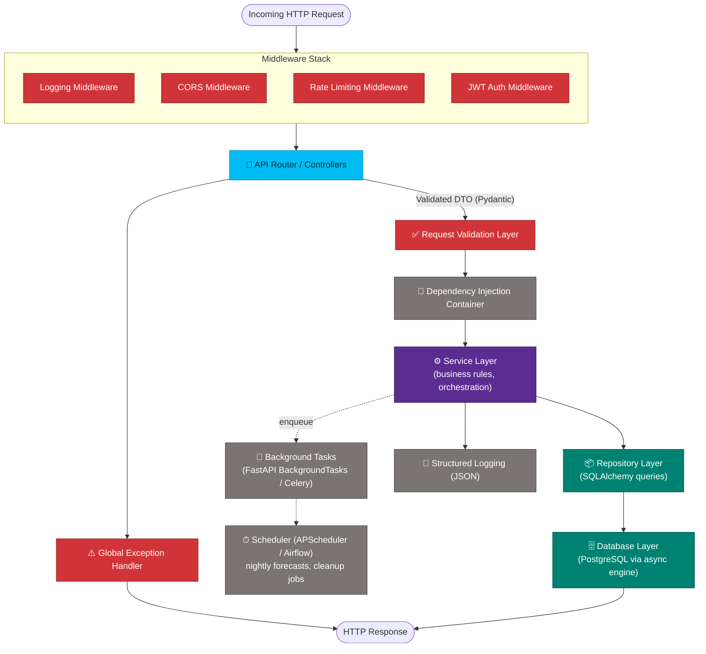
```mermaid
%% BACKEND ARCHITECTURE — FastAPI Layered Design
flowchart TB
    classDef mid fill:#D13438,color:#fff,stroke:#8E2226
    classDef ctrl fill:#00BCF2,color:#062B3E,stroke:#008DBF
    classDef svc fill:#5C2D91,color:#fff,stroke:#3B1E63
    classDef repo fill:#008272,color:#fff,stroke:#00564C
    classDef infra fill:#7A7574,color:#fff,stroke:#4C4A48

    Req(["Incoming HTTP Request"]) --> MW

    subgraph MW["Middleware Stack"]
        direction TB
        LogMW["Logging Middleware"]:::mid
        CorsMW["CORS Middleware"]:::mid
        RateMW["Rate Limiting Middleware"]:::mid
        AuthMW["JWT Auth Middleware"]:::mid
    end

    MW --> Router["🚦 API Router / Controllers"]:::ctrl
    Router -->|"Validated DTO (Pydantic)"| Valid["✅ Request Validation Layer"]:::mid
    Valid --> DI["🧩 Dependency Injection Container"]:::infra
    DI --> Services["⚙️ Service Layer\n(business rules, orchestration)"]:::svc
    Services --> Repos["📦 Repository Layer\n(SQLAlchemy queries)"]:::repo
    Repos --> DBLayer["🗄 Database Layer\n(PostgreSQL via async engine)"]:::repo

    Services -.->|"enqueue"| BGTasks["🔁 Background Tasks\n(FastAPI BackgroundTasks / Celery)"]:::infra
    BGTasks -.-> Scheduler["⏱ Scheduler (APScheduler / Airflow)\nnightly forecasts, cleanup jobs"]:::infra

    Services --> Logger["📝 Structured Logging (JSON)"]:::infra
    Router --> ExceptionHandler["⚠️ Global Exception Handler"]:::mid
    ExceptionHandler --> Response(["HTTP Response"])
    DBLayer --> Response
```

---

## 5. Authentication Architecture

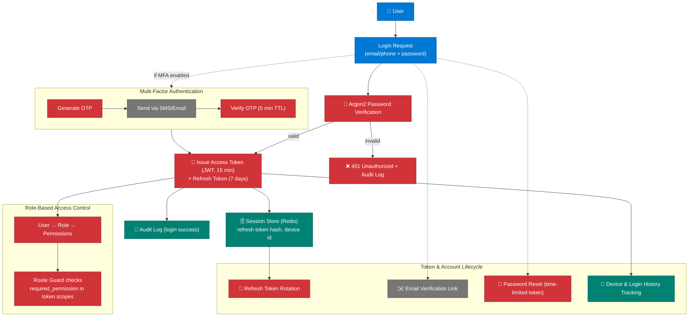
```mermaid
%% AUTHENTICATION ARCHITECTURE
flowchart TB
    classDef client fill:#0078D4,color:#fff,stroke:#005A9E
    classDef sec fill:#D13438,color:#fff,stroke:#8E2226
    classDef data fill:#008272,color:#fff,stroke:#00564C
    classDef ext fill:#767676,color:#fff,stroke:#4C4A48

    User["👤 User"]:::client --> Login["Login Request\n(email/phone + password)"]:::client
    Login --> Hash["🔑 Argon2 Password Verification"]:::sec
    Hash -->|"valid"| IssueJWT["🎫 Issue Access Token (JWT, 15 min)\n+ Refresh Token (7 days)"]:::sec
    Hash -->|"invalid"| Reject["❌ 401 Unauthorized + Audit Log"]:::sec

    IssueJWT --> Session["🗄 Session Store (Redis)\nrefresh token hash, device id"]:::data
    IssueJWT --> AuditLog["📝 Audit Log (login success)"]:::data

    subgraph MFA_FLOW["Multi-Factor Authentication"]
        OTPGen["Generate OTP"]:::sec --> OTPSend["Send via SMS/Email"]:::ext
        OTPSend --> OTPVerify["Verify OTP (5 min TTL)"]:::sec
    end
    Login -.->|"if MFA enabled"| MFA_FLOW
    MFA_FLOW --> IssueJWT

    subgraph RBAC["Role-Based Access Control"]
        Role["User → Role → Permissions"]:::sec
        Guard["Route Guard checks\nrequired_permission in token scopes"]:::sec
    end
    IssueJWT --> Role --> Guard

    subgraph LIFECYCLE["Token & Account Lifecycle"]
        Refresh["🔁 Refresh Token Rotation"]:::sec
        EmailVerify["✉️ Email Verification Link"]:::ext
        PwdReset["🔐 Password Reset (time-limited token)"]:::sec
        DeviceTrack["📱 Device & Login History Tracking"]:::data
    end
    Session --> Refresh
    IssueJWT --> DeviceTrack
    Login -.-> EmailVerify
    Login -.-> PwdReset
```

---

## 6. Database Architecture (ERD)

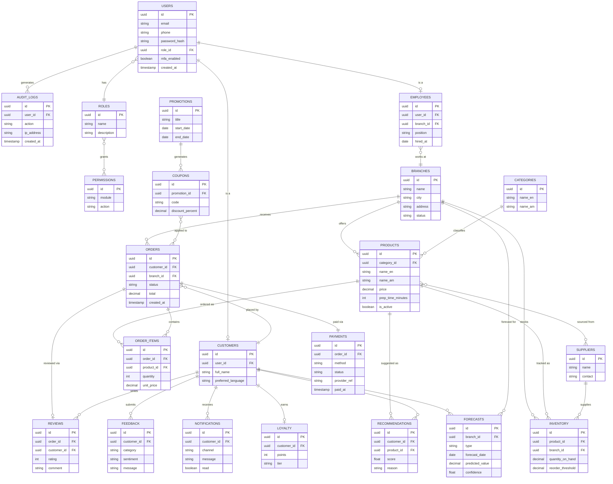
```mermaid
%% DATABASE ARCHITECTURE — ENTITY RELATIONSHIP DIAGRAM
erDiagram
    USERS ||--o{ AUDIT_LOGS : generates
    USERS }o--|| ROLES : "has"
    ROLES }o--o{ PERMISSIONS : "grants"
    USERS ||--o| CUSTOMERS : "is a"
    USERS ||--o| EMPLOYEES : "is a"
    EMPLOYEES }o--|| BRANCHES : "works at"
    BRANCHES ||--o{ PRODUCTS : offers
    BRANCHES ||--o{ INVENTORY : stocks
    BRANCHES ||--o{ ORDERS : receives
    CATEGORIES ||--o{ PRODUCTS : classifies
    PRODUCTS ||--o{ ORDER_ITEMS : "ordered as"
    PRODUCTS ||--o{ INVENTORY : "tracked as"
    PRODUCTS ||--o{ RECOMMENDATIONS : "suggested as"
    PRODUCTS }o--o{ SUPPLIERS : "sourced from"
    ORDERS ||--o{ ORDER_ITEMS : contains
    ORDERS ||--|| PAYMENTS : "paid via"
    ORDERS }o--|| CUSTOMERS : "placed by"
    ORDERS ||--o| REVIEWS : "reviewed via"
    CUSTOMERS ||--o{ REVIEWS : writes
    CUSTOMERS ||--o{ FEEDBACK : submits
    CUSTOMERS ||--o{ NOTIFICATIONS : receives
    CUSTOMERS ||--o| LOYALTY : "earns"
    CUSTOMERS ||--o{ RECOMMENDATIONS : "receives"
    CUSTOMERS ||--o{ FORECASTS : "segmented in"
    PROMOTIONS ||--o{ COUPONS : generates
    COUPONS }o--o{ ORDERS : "applied to"
    BRANCHES ||--o{ FORECASTS : "forecast for"
    SUPPLIERS ||--o{ INVENTORY : supplies

    USERS {
        uuid id PK
        string email
        string phone
        string password_hash
        uuid role_id FK
        boolean mfa_enabled
        timestamp created_at
    }
    ROLES {
        uuid id PK
        string name
        string description
    }
    PERMISSIONS {
        uuid id PK
        string module
        string action
    }
    CUSTOMERS {
        uuid id PK
        uuid user_id FK
        string full_name
        string preferred_language
    }
    EMPLOYEES {
        uuid id PK
        uuid user_id FK
        uuid branch_id FK
        string position
        date hired_at
    }
    BRANCHES {
        uuid id PK
        string name
        string city
        string address
        string status
    }
    PRODUCTS {
        uuid id PK
        uuid category_id FK
        string name_en
        string name_am
        decimal price
        int prep_time_minutes
        boolean is_active
    }
    CATEGORIES {
        uuid id PK
        string name_en
        string name_am
    }
    ORDERS {
        uuid id PK
        uuid customer_id FK
        uuid branch_id FK
        string status
        decimal total
        timestamp created_at
    }
    ORDER_ITEMS {
        uuid id PK
        uuid order_id FK
        uuid product_id FK
        int quantity
        decimal unit_price
    }
    PAYMENTS {
        uuid id PK
        uuid order_id FK
        string method
        string status
        string provider_ref
        timestamp paid_at
    }
    INVENTORY {
        uuid id PK
        uuid product_id FK
        uuid branch_id FK
        decimal quantity_on_hand
        decimal reorder_threshold
    }
    SUPPLIERS {
        uuid id PK
        string name
        string contact
    }
    RECOMMENDATIONS {
        uuid id PK
        uuid customer_id FK
        uuid product_id FK
        float score
        string reason
    }
    FORECASTS {
        uuid id PK
        uuid branch_id FK
        string type
        date forecast_date
        decimal predicted_value
        float confidence
    }
    REVIEWS {
        uuid id PK
        uuid order_id FK
        uuid customer_id FK
        int rating
        string comment
    }
    FEEDBACK {
        uuid id PK
        uuid customer_id FK
        string category
        string sentiment
        string message
    }
    NOTIFICATIONS {
        uuid id PK
        uuid customer_id FK
        string channel
        string message
        boolean read
    }
    PROMOTIONS {
        uuid id PK
        string title
        date start_date
        date end_date
    }
    COUPONS {
        uuid id PK
        uuid promotion_id FK
        string code
        decimal discount_percent
    }
    LOYALTY {
        uuid id PK
        uuid customer_id FK
        int points
        string tier
    }
    AUDIT_LOGS {
        uuid id PK
        uuid user_id FK
        string action
        string ip_address
        timestamp created_at
    }
```

---

## 7. Microservice Architecture

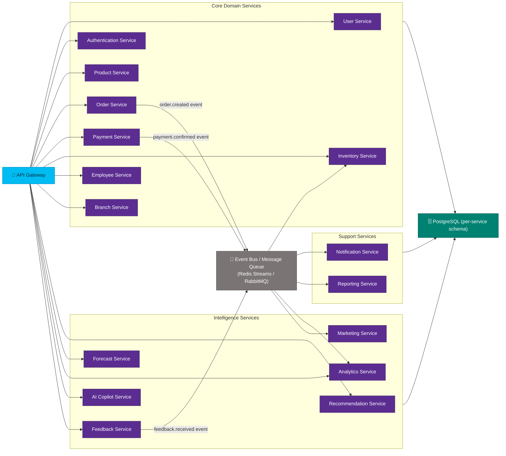
```mermaid
%% MICROSERVICE ARCHITECTURE
flowchart LR
    classDef gw fill:#00BCF2,color:#062B3E,stroke:#008DBF
    classDef svc fill:#5C2D91,color:#fff,stroke:#3B1E63
    classDef data fill:#008272,color:#fff,stroke:#00564C
    classDef bus fill:#7A7574,color:#fff,stroke:#4C4A48

    GW["🔀 API Gateway"]:::gw

    subgraph CORE["Core Domain Services"]
        UserSvc["User Service"]:::svc
        AuthSvc["Authentication Service"]:::svc
        ProductSvc["Product Service"]:::svc
        OrderSvc["Order Service"]:::svc
        PaymentSvc["Payment Service"]:::svc
        InventorySvc["Inventory Service"]:::svc
        EmployeeSvc["Employee Service"]:::svc
        BranchSvc["Branch Service"]:::svc
    end

    subgraph INTELLIGENCE["Intelligence Services"]
        RecoSvc["Recommendation Service"]:::svc
        ForecastSvc["Forecast Service"]:::svc
        AnalyticsSvc["Analytics Service"]:::svc
        MarketingSvc["Marketing Service"]:::svc
        CopilotSvc["AI Copilot Service"]:::svc
        FeedbackSvc["Feedback Service"]:::svc
    end

    subgraph SUPPORT["Support Services"]
        NotifSvc["Notification Service"]:::svc
        ReportSvc["Reporting Service"]:::svc
    end

    Bus["📨 Event Bus / Message Queue\n(Redis Streams / RabbitMQ)"]:::bus
    DB["🗄 PostgreSQL (per-service schema)"]:::data

    GW --> UserSvc & AuthSvc & ProductSvc & OrderSvc & PaymentSvc & InventorySvc & EmployeeSvc & BranchSvc
    GW --> RecoSvc & ForecastSvc & AnalyticsSvc & CopilotSvc & FeedbackSvc

    OrderSvc -->|"order.created event"| Bus
    Bus --> InventorySvc
    Bus --> NotifSvc
    Bus --> AnalyticsSvc
    PaymentSvc -->|"payment.confirmed event"| Bus
    Bus --> ReportSvc
    FeedbackSvc -->|"feedback.received event"| Bus
    Bus --> MarketingSvc

    CORE --> DB
    INTELLIGENCE --> DB
    SUPPORT --> DB
```

---

## 8. Payment Architecture

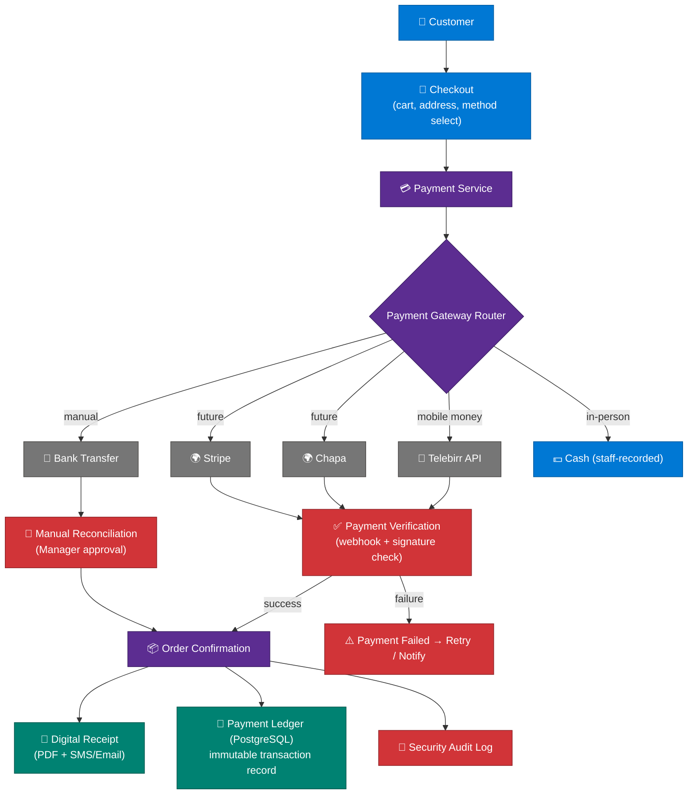
```mermaid
%% PAYMENT ARCHITECTURE
flowchart TB
    classDef client fill:#0078D4,color:#fff,stroke:#005A9E
    classDef svc fill:#5C2D91,color:#fff,stroke:#3B1E63
    classDef ext fill:#767676,color:#fff,stroke:#4C4A48
    classDef sec fill:#D13438,color:#fff,stroke:#8E2226
    classDef data fill:#008272,color:#fff,stroke:#00564C

    Customer["👤 Customer"]:::client --> Checkout["🛒 Checkout\n(cart, address, method select)"]:::client
    Checkout --> PaymentSvc["💳 Payment Service"]:::svc
    PaymentSvc --> Gateway{"Payment Gateway Router"}:::svc

    Gateway -->|"mobile money"| Telebirr["📲 Telebirr API"]:::ext
    Gateway -->|"future"| Chapa["🌍 Chapa"]:::ext
    Gateway -->|"future"| Stripe["🌍 Stripe"]:::ext
    Gateway -->|"manual"| BankTransfer["🏦 Bank Transfer"]:::ext
    Gateway -->|"in-person"| Cash["💵 Cash (staff-recorded)"]:::client

    Telebirr --> Verify["✅ Payment Verification\n(webhook + signature check)"]:::sec
    Chapa --> Verify
    Stripe --> Verify
    BankTransfer --> ManualVerify["🧾 Manual Reconciliation\n(Manager approval)"]:::sec

    Verify -->|"success"| Confirm["📦 Order Confirmation"]:::svc
    Verify -->|"failure"| Retry["⚠️ Payment Failed → Retry / Notify"]:::sec
    ManualVerify --> Confirm

    Confirm --> Receipt["🧾 Digital Receipt\n(PDF + SMS/Email)"]:::data
    Confirm --> Ledger["📒 Payment Ledger (PostgreSQL)\nimmutable transaction record"]:::data
    Confirm --> AuditLog["📝 Security Audit Log"]:::sec
```

---

## 9. AI Architecture

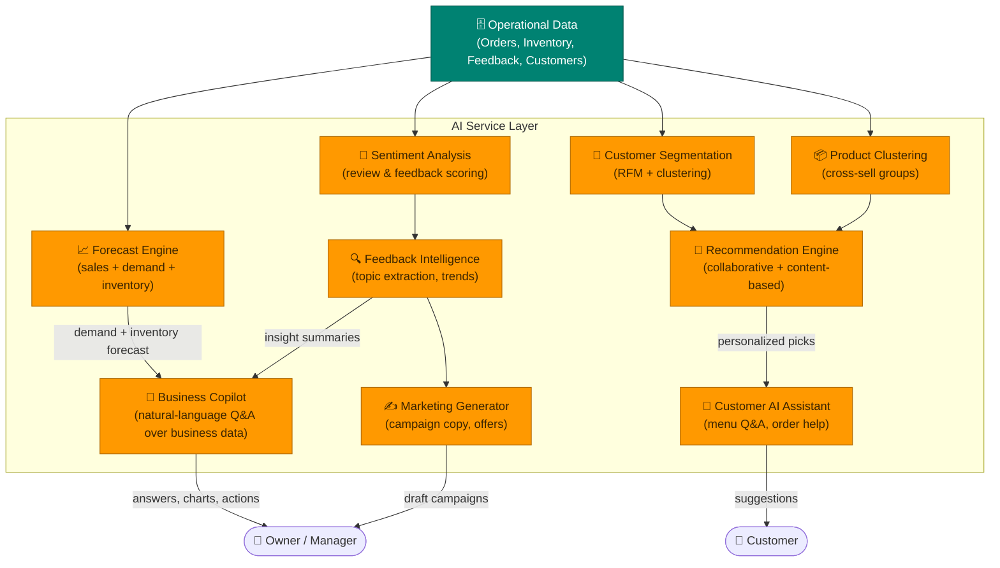
```mermaid
%% AI ARCHITECTURE — OVERVIEW OF ALL AI SUBSYSTEMS
flowchart TB
    classDef ai fill:#FF9900,color:#3B2400,stroke:#B36B00
    classDef data fill:#008272,color:#fff,stroke:#00564C
    classDef svc fill:#5C2D91,color:#fff,stroke:#3B1E63

    Data["🗄 Operational Data\n(Orders, Inventory, Feedback, Customers)"]:::data

    subgraph AI_CORE["AI Service Layer"]
        Copilot["🤖 Business Copilot\n(natural-language Q&A over business data)"]:::ai
        CustAssist["💬 Customer AI Assistant\n(menu Q&A, order help)"]:::ai
        Reco["🎯 Recommendation Engine\n(collaborative + content-based)"]:::ai
        ForecastEngine["📈 Forecast Engine\n(sales + demand + inventory)"]:::ai
        Sentiment["🙂 Sentiment Analysis\n(review & feedback scoring)"]:::ai
        FeedbackIntel["🔍 Feedback Intelligence\n(topic extraction, trends)"]:::ai
        MktGen["✍️ Marketing Generator\n(campaign copy, offers)"]:::ai
        Segment["🧩 Customer Segmentation\n(RFM + clustering)"]:::ai
        ProductCluster["📦 Product Clustering\n(cross-sell groups)"]:::ai
    end

    Data --> ForecastEngine
    Data --> Segment --> Reco
    Data --> ProductCluster --> Reco
    Data --> Sentiment --> FeedbackIntel --> MktGen
    ForecastEngine -->|"demand + inventory forecast"| Copilot
    Reco -->|"personalized picks"| CustAssist
    FeedbackIntel -->|"insight summaries"| Copilot
    Copilot -->|"answers, charts, actions"| Owner(["👤 Owner / Manager"])
    CustAssist -->|"suggestions"| Cust(["👤 Customer"])
    MktGen -->|"draft campaigns"| Owner
```

---

## 10. RAG Architecture

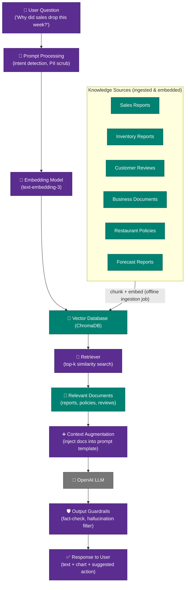
```mermaid
%% RAG (RETRIEVAL-AUGMENTED GENERATION) ARCHITECTURE
flowchart TB
    classDef flow fill:#5C2D91,color:#fff,stroke:#3B1E63
    classDef data fill:#008272,color:#fff,stroke:#00564C
    classDef ext fill:#767676,color:#fff,stroke:#4C4A48

    Q["👤 User Question\n('Why did sales drop this week?')"]:::flow
    Q --> Prompt["📝 Prompt Processing\n(intent detection, PII scrub)"]:::flow
    Prompt --> Embed["🧮 Embedding Model\n(text-embedding-3)"]:::flow
    Embed --> VecDB["🧠 Vector Database (ChromaDB)"]:::data
    VecDB --> Retriever["🔎 Retriever\n(top-k similarity search)"]:::flow
    Retriever --> Docs["📄 Relevant Documents\n(reports, policies, reviews)"]:::data
    Docs --> Augment["➕ Context Augmentation\n(inject docs into prompt template)"]:::flow
    Augment --> LLM["🤖 OpenAI LLM"]:::ext
    LLM --> Guard["🛡 Output Guardrails\n(fact-check, hallucination filter)"]:::flow
    Guard --> Resp["✅ Response to User\n(text + chart + suggested action)"]:::flow

    subgraph SOURCES["Knowledge Sources (ingested & embedded)"]
        S1["Sales Reports"]:::data
        S2["Inventory Reports"]:::data
        S3["Customer Reviews"]:::data
        S4["Business Documents"]:::data
        S5["Restaurant Policies"]:::data
        S6["Forecast Reports"]:::data
    end
    SOURCES -->|"chunk + embed (offline ingestion job)"| VecDB
```

---

## 11. Machine Learning Architecture (MLOps)

```mermaid
%% MACHINE LEARNING ARCHITECTURE (MLOps Pipeline)
flowchart LR
    classDef step fill:#FF9900,color:#3B2400,stroke:#B36B00
    classDef data fill:#008272,color:#fff,stroke:#00564C
    classDef infra fill:#7A7574,color:#fff,stroke:#4C4A48

    Raw["🗄 Raw Data"]:::data --> ETL["🔄 ETL"]:::step --> Clean["🧹 Data Cleaning"]:::step
    Clean --> Feat["🧬 Feature Engineering"]:::step --> Train["🏋️ Model Training"]:::step
    Train --> Eval["📏 Evaluation"]:::step --> Tune["🎛 Hyperparameter Tuning"]:::step
    Tune --> MLflow["📊 MLflow Tracking"]:::infra --> Registry["📦 Model Registry"]:::infra
    Registry --> API["🚀 Prediction API (FastAPI)"]:::step --> Monitor["📡 Monitoring\n(drift + accuracy)"]:::infra
    Monitor -.->|"trigger retrain on drift"| Train

    subgraph MODELS["Models Trained"]
        M1["Sales Forecast\n(Prophet / LightGBM)"]:::step
        M2["Demand Forecast\n(per-product, per-branch)"]:::step
        M3["Recommendation\n(ALS / LightFM)"]:::step
        M4["Customer Segmentation\n(K-Means on RFM)"]:::step
        M5["Product Clustering\n(hierarchical clustering)"]:::step
    end
    Train --> MODELS
```

---

## 12. Data Engineering Architecture

```mermaid
%% DATA ENGINEERING ARCHITECTURE
flowchart LR
    classDef src fill:#0078D4,color:#fff,stroke:#005A9E
    classDef step fill:#5C2D91,color:#fff,stroke:#3B1E63
    classDef data fill:#008272,color:#fff,stroke:#00564C
    classDef infra fill:#7A7574,color:#fff,stroke:#4C4A48

    subgraph SOURCES["Source Systems"]
        Orders["Orders"]:::src
        Payments["Payments"]:::src
        Inventory["Inventory"]:::src
        Customers["Customers"]:::src
        Feedback["Feedback"]:::src
    end

    SOURCES --> ETL["🔄 ETL Jobs\n(extract nightly + streaming CDC)"]:::step
    ETL --> Validate["✅ Validation\n(schema + null + range checks)"]:::step
    Validate --> Transform["🔧 Transformation\n(normalize, join, aggregate)"]:::step
    Transform --> FeatureStore["🧬 Feature Store\n(precomputed ML features)"]:::data
    Transform --> Postgres["🗄 PostgreSQL\n(curated analytics schema)"]:::data
    Postgres --> Analytics["📊 Analytics & BI\n(dashboards, reports)"]:::step
    FeatureStore --> MLTraining["🏋️ ML Training Jobs"]:::step

    Airflow["⏱ Apache Airflow\n(DAG orchestration & scheduling)"]:::infra
    Airflow -.->|"orchestrates"| ETL
    Airflow -.->|"orchestrates"| Validate
    Airflow -.->|"orchestrates"| Transform
```

---

## 13. DevOps Architecture (CI/CD)

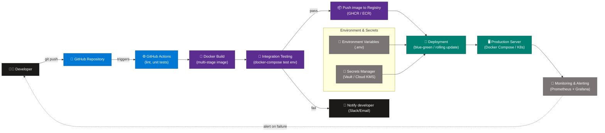
```mermaid
%% DEVOPS ARCHITECTURE (CI/CD)
flowchart LR
    classDef dev fill:#1B1A19,color:#fff,stroke:#000
    classDef ci fill:#0078D4,color:#fff,stroke:#005A9E
    classDef build fill:#5C2D91,color:#fff,stroke:#3B1E63
    classDef deploy fill:#008272,color:#fff,stroke:#00564C
    classDef mon fill:#7A7574,color:#fff,stroke:#4C4A48

    Dev["👨‍💻 Developer"]:::dev -->|"git push"| GitHub["🐙 GitHub Repository"]:::ci
    GitHub -->|"triggers"| Actions["⚙️ GitHub Actions\n(lint, unit tests)"]:::ci
    Actions --> DockerBuild["🐳 Docker Build\n(multi-stage image)"]:::build
    DockerBuild --> Test["🧪 Integration Testing\n(docker-compose test env)"]:::build
    Test -->|"pass"| Push["📦 Push image to Registry\n(GHCR / ECR)"]:::build
    Test -->|"fail"| Notify["🔔 Notify developer (Slack/Email)"]:::dev
    Push --> Deploy["🚀 Deployment\n(blue-green / rolling update)"]:::deploy
    Deploy --> Prod["🖥 Production Server\n(Docker Compose / K8s)"]:::deploy
    Prod --> Monitoring["📡 Monitoring & Alerting\n(Prometheus + Grafana)"]:::mon
    Monitoring -.->|"alert on failure"| Dev

    subgraph ENV["Environment & Secrets"]
        EnvVars["🔑 Environment Variables (.env)"]:::mon
        Secrets["🔐 Secrets Manager\n(Vault / Cloud KMS)"]:::mon
    end
    EnvVars --> Deploy
    Secrets --> Deploy
```

---

## 14. Deployment Diagram

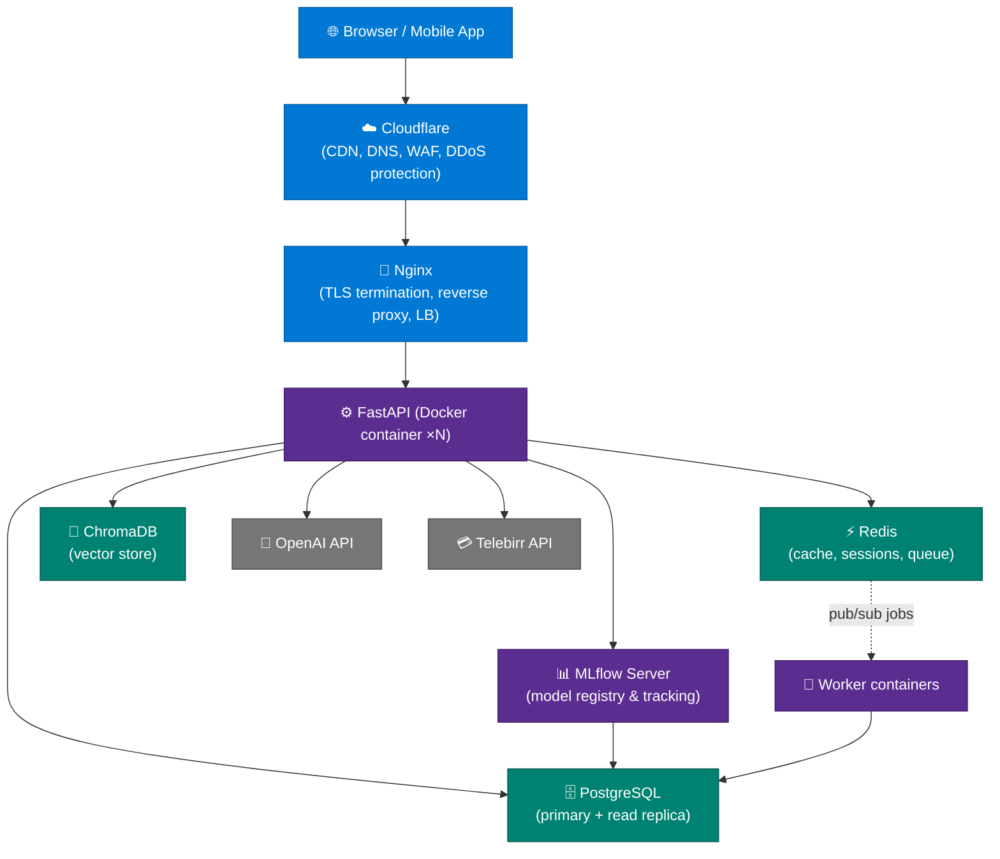
```mermaid
%% DEPLOYMENT DIAGRAM
flowchart TB
    classDef edge fill:#0078D4,color:#fff,stroke:#005A9E
    classDef app fill:#5C2D91,color:#fff,stroke:#3B1E63
    classDef data fill:#008272,color:#fff,stroke:#00564C
    classDef ext fill:#767676,color:#fff,stroke:#4C4A48

    Browser["🌐 Browser / Mobile App"]:::edge --> CF["☁️ Cloudflare\n(CDN, DNS, WAF, DDoS protection)"]:::edge
    CF --> Nginx["🚪 Nginx\n(TLS termination, reverse proxy, LB)"]:::edge
    Nginx --> FastAPI["⚙️ FastAPI (Docker container ×N)"]:::app
    FastAPI --> Redis["⚡ Redis\n(cache, sessions, queue)"]:::data
    FastAPI --> Postgres["🗄 PostgreSQL\n(primary + read replica)"]:::data
    FastAPI --> MLflow["📊 MLflow Server\n(model registry & tracking)"]:::app
    FastAPI --> Chroma["🧠 ChromaDB\n(vector store)"]:::data
    FastAPI --> OpenAI["🤖 OpenAI API"]:::ext
    FastAPI --> TelebirrAPI["💳 Telebirr API"]:::ext
    MLflow --> Postgres
    Redis -.->|"pub/sub jobs"| Worker["🔁 Worker containers"]:::app
    Worker --> Postgres
```

---

## 15. Network Architecture

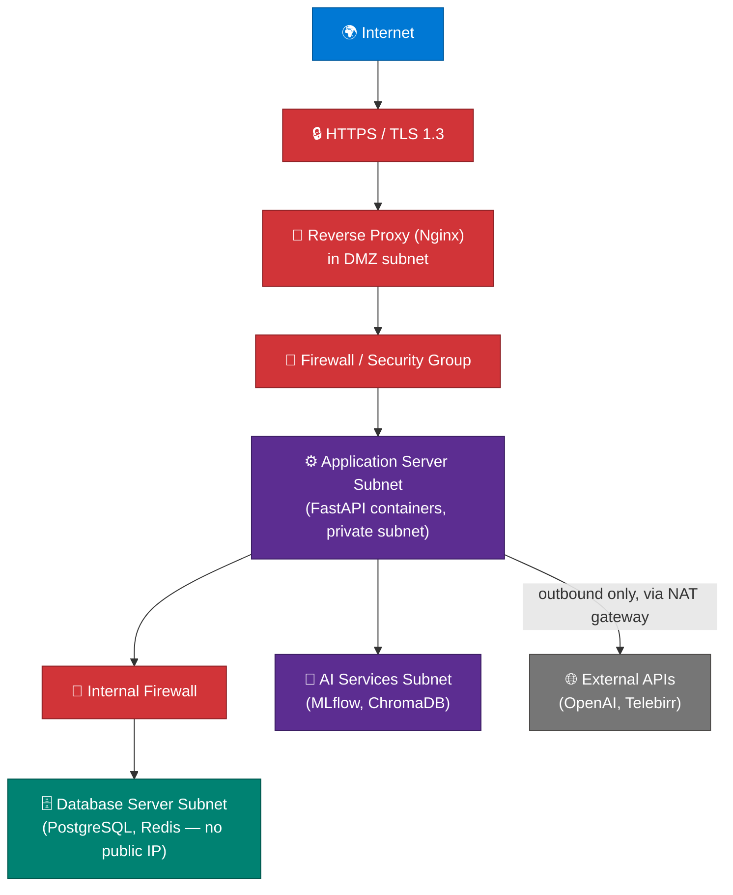
```mermaid
%% NETWORK ARCHITECTURE
flowchart TB
    classDef net fill:#0078D4,color:#fff,stroke:#005A9E
    classDef sec fill:#D13438,color:#fff,stroke:#8E2226
    classDef app fill:#5C2D91,color:#fff,stroke:#3B1E63
    classDef data fill:#008272,color:#fff,stroke:#00564C
    classDef ext fill:#767676,color:#fff,stroke:#4C4A48

    Internet["🌍 Internet"]:::net --> HTTPS["🔒 HTTPS / TLS 1.3"]:::sec
    HTTPS --> RP["🚪 Reverse Proxy (Nginx)\nin DMZ subnet"]:::sec
    RP --> FW1["🧱 Firewall / Security Group"]:::sec
    FW1 --> AppServer["⚙️ Application Server Subnet\n(FastAPI containers, private subnet)"]:::app
    AppServer --> FW2["🧱 Internal Firewall"]:::sec
    FW2 --> DBServer["🗄 Database Server Subnet\n(PostgreSQL, Redis — no public IP)"]:::data
    AppServer --> AISvc["🤖 AI Services Subnet\n(MLflow, ChromaDB)"]:::app
    AppServer -->|"outbound only, via NAT gateway"| ExtAPIs["🌐 External APIs\n(OpenAI, Telebirr)"]:::ext

    classDef zone fill:none,stroke:#999,stroke-dasharray: 4 4
```

---

## 16. Security Architecture

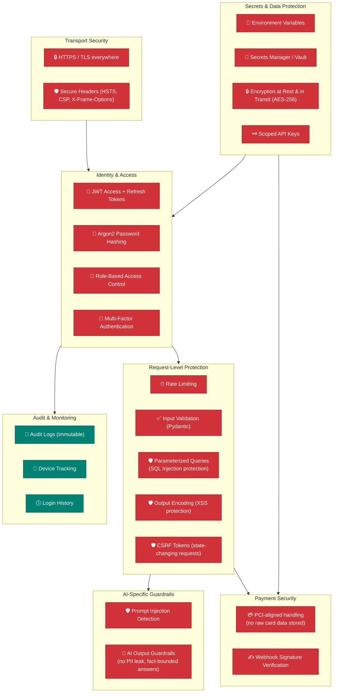
```mermaid
%% SECURITY ARCHITECTURE
flowchart TB
    classDef sec fill:#D13438,color:#fff,stroke:#8E2226
    classDef app fill:#5C2D91,color:#fff,stroke:#3B1E63
    classDef data fill:#008272,color:#fff,stroke:#00564C

    subgraph TRANSPORT["Transport Security"]
        HTTPS["🔒 HTTPS / TLS everywhere"]:::sec
        Headers["🛡 Secure Headers (HSTS, CSP, X-Frame-Options)"]:::sec
    end

    subgraph IDENTITY["Identity & Access"]
        JWT["🎫 JWT Access + Refresh Tokens"]:::sec
        Argon2["🔑 Argon2 Password Hashing"]:::sec
        RBAC["👥 Role-Based Access Control"]:::sec
        MFA["📱 Multi-Factor Authentication"]:::sec
    end

    subgraph REQUEST_PROTECTION["Request-Level Protection"]
        RateLimit["⏱ Rate Limiting"]:::sec
        InputVal["✅ Input Validation (Pydantic)"]:::sec
        SQLi["🛡 Parameterized Queries\n(SQL Injection protection)"]:::sec
        XSS["🛡 Output Encoding (XSS protection)"]:::sec
        CSRF["🛡 CSRF Tokens (state-changing requests)"]:::sec
    end

    subgraph AI_SECURITY["AI-Specific Guardrails"]
        PromptInj["🛡 Prompt Injection Detection"]:::sec
        Guardrails["🚧 AI Output Guardrails\n(no PII leak, fact-bounded answers)"]:::sec
    end

    subgraph SECRETS["Secrets & Data Protection"]
        EnvVars["🔑 Environment Variables"]:::sec
        SecretsMgr["🔐 Secrets Manager / Vault"]:::sec
        Encryption["🔒 Encryption at Rest & in Transit (AES-256)"]:::sec
        APIKeys["🗝 Scoped API Keys"]:::sec
    end

    subgraph AUDIT["Audit & Monitoring"]
        AuditLogs["📝 Audit Logs (immutable)"]:::data
        DeviceTrack["📱 Device Tracking"]:::data
        LoginHistory["🕓 Login History"]:::data
    end

    subgraph PAYMENT_SEC["Payment Security"]
        PCI["💳 PCI-aligned handling\n(no raw card data stored)"]:::sec
        WebhookSig["✍️ Webhook Signature Verification"]:::sec
    end

    TRANSPORT --> IDENTITY --> REQUEST_PROTECTION --> AI_SECURITY
    REQUEST_PROTECTION --> PAYMENT_SEC
    IDENTITY --> AUDIT
    SECRETS --> IDENTITY
    SECRETS --> PAYMENT_SEC
```

---

## 17. Sequence Diagrams

### 17.01 Sequence — Registration

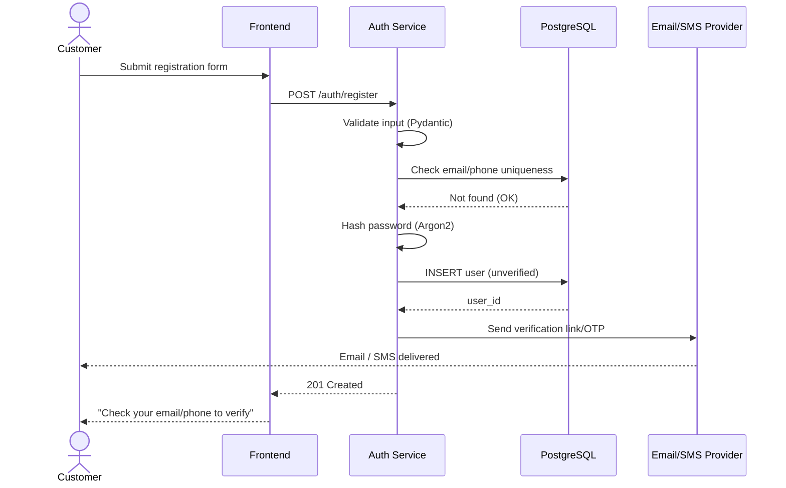
```mermaid
%% SEQUENCE — User Registration
sequenceDiagram
    actor U as Customer
    participant FE as Frontend
    participant API as Auth Service
    participant DB as PostgreSQL
    participant MAIL as Email/SMS Provider

    U->>FE: Submit registration form
    FE->>API: POST /auth/register
    API->>API: Validate input (Pydantic)
    API->>DB: Check email/phone uniqueness
    DB-->>API: Not found (OK)
    API->>API: Hash password (Argon2)
    API->>DB: INSERT user (unverified)
    DB-->>API: user_id
    API->>MAIL: Send verification link/OTP
    MAIL-->>U: Email / SMS delivered
    API-->>FE: 201 Created
    FE-->>U: "Check your email/phone to verify"
```

### 17.02 Sequence — Login

```mermaid
%% SEQUENCE — Login
sequenceDiagram
    actor U as User
    participant FE as Frontend
    participant API as Auth Service
    participant DB as PostgreSQL
    participant CACHE as Redis

    U->>FE: Enter credentials
    FE->>API: POST /auth/login
    API->>DB: Fetch user by email
    DB-->>API: user record + password_hash
    API->>API: Verify Argon2 hash
    alt valid credentials
        API->>API: Generate JWT access + refresh token
        API->>CACHE: Store refresh token + device id
        API->>DB: Write audit log (login success)
        API-->>FE: 200 OK { access_token, refresh_token }
        FE-->>U: Redirect to role-based dashboard
    else invalid credentials
        API->>DB: Write audit log (login failed)
        API-->>FE: 401 Unauthorized
        FE-->>U: Show error message
    end
```

### 17.03 Sequence — Order Placement

```mermaid
%% SEQUENCE — Order Placement
sequenceDiagram
    actor C as Customer
    participant FE as Frontend
    participant API as Order Service
    participant INV as Inventory Service
    participant DB as PostgreSQL
    participant NOTIF as Notification Service

    C->>FE: Add items, submit order
    FE->>API: POST /orders
    API->>INV: Check stock availability
    INV-->>API: Stock sufficient
    API->>DB: Create order (status = pending)
    DB-->>API: order_id
    API->>INV: Reserve stock for order
    API->>NOTIF: Notify kitchen/staff (new order)
    API-->>FE: 201 Created { order_id, status }
    FE-->>C: "Order placed — proceed to payment"
```

### 17.04 Sequence — Checkout

```mermaid
%% SEQUENCE — Checkout
sequenceDiagram
    actor C as Customer
    participant FE as Frontend
    participant API as Order Service
    participant PAY as Payment Service
    participant DB as PostgreSQL

    C->>FE: Review cart, select payment method
    FE->>API: POST /orders/{id}/checkout
    API->>DB: Lock order, calculate totals (tax, delivery)
    DB-->>API: totals confirmed
    API->>PAY: Initiate payment(order_id, method, amount)
    PAY-->>API: payment_intent_id
    API-->>FE: 200 OK { payment_intent_id }
    FE-->>C: Redirect to payment method screen
```

### 17.05 Sequence — Telebirr Payment

```mermaid
%% SEQUENCE — Telebirr Payment
sequenceDiagram
    actor C as Customer
    participant FE as Frontend
    participant PAY as Payment Service
    participant TB as Telebirr API
    participant DB as PostgreSQL
    participant ORD as Order Service

    C->>FE: Confirm Telebirr payment (PIN on phone)
    FE->>PAY: POST /payments/telebirr/charge
    PAY->>TB: Create payment request
    TB-->>PAY: Redirect / USSD prompt sent to customer phone
    C->>TB: Approve payment on phone
    TB->>PAY: Webhook: payment.success (signed)
    PAY->>PAY: Verify webhook signature
    PAY->>DB: Update payment status = confirmed
    PAY->>ORD: Mark order as paid
    ORD->>DB: Update order status = confirmed
    ORD-->>FE: Push order confirmation (WebSocket)
    FE-->>C: "Payment successful — receipt sent"
```

### 17.06 Sequence — Recommendation

```mermaid
%% SEQUENCE — Recommendation Request
sequenceDiagram
    actor C as Customer
    participant FE as Frontend
    participant API as Recommendation Service
    participant CACHE as Redis
    participant ML as Reco Model (MLflow-served)
    participant DB as PostgreSQL

    C->>FE: Open Home / Menu screen
    FE->>API: GET /recommendations?customer_id=...
    API->>CACHE: Check cached recommendations
    alt cache hit
        CACHE-->>API: cached list
    else cache miss
        API->>DB: Fetch customer purchase history
        DB-->>API: history
        API->>ML: Predict(customer_features)
        ML-->>API: ranked product list + scores
        API->>CACHE: Store with 15 min TTL
    end
    API-->>FE: 200 OK { recommendations }
    FE-->>C: Render "Recommended for you"
```

### 17.07 Sequence — Forecast Request

```mermaid
%% SEQUENCE — Forecast Request
sequenceDiagram
    actor O as Owner
    participant FE as Owner Dashboard
    participant API as Forecast Service
    participant REG as Model Registry (MLflow)
    participant DB as PostgreSQL

    O->>FE: Open Forecasting dashboard
    FE->>API: GET /forecast/revenue?branch_id=...&range=weekly
    API->>DB: Check for existing precomputed forecast
    alt fresh forecast exists
        DB-->>API: forecast rows
    else needs computation
        API->>REG: Load latest production model
        REG-->>API: model artifact
        API->>DB: Fetch recent sales/features
        DB-->>API: features
        API->>API: Run inference + confidence intervals
        API->>DB: Persist forecast rows
    end
    API-->>FE: 200 OK { forecast, confidence, accuracy }
    FE-->>O: Render forecast chart
```

### 17.08 Sequence — Copilot Chat

```mermaid
%% SEQUENCE — Business Copilot Chat
sequenceDiagram
    actor O as Owner
    participant FE as Copilot UI
    participant API as Copilot Service
    participant RAG as RAG Pipeline
    participant VDB as ChromaDB
    participant LLM as OpenAI API
    participant DB as PostgreSQL

    O->>FE: "Why did sales decrease this week?"
    FE->>API: POST /copilot/chat { message }
    API->>DB: Pull relevant live metrics (sales, orders)
    API->>RAG: Retrieve supporting context(query)
    RAG->>VDB: Similarity search (embeddings)
    VDB-->>RAG: top-k documents (reports, notes)
    RAG-->>API: context chunks
    API->>LLM: Prompt(system + context + metrics + question)
    LLM-->>API: Generated answer + suggested chart spec
    API->>API: Guardrail check (no hallucinated figures)
    API-->>FE: 200 OK { answer, chart_data }
    FE-->>O: Render chat bubble + inline chart
```

### 17.09 Sequence — Feedback

```mermaid
%% SEQUENCE — Customer Feedback
sequenceDiagram
    actor C as Customer
    participant FE as Frontend
    participant API as Feedback Service
    participant NLP as Sentiment Model
    participant DB as PostgreSQL
    participant MKT as Marketing Service

    C->>FE: Submit review/feedback + rating
    FE->>API: POST /feedback
    API->>DB: Store raw feedback
    API->>NLP: Analyze sentiment + extract topics
    NLP-->>API: sentiment=negative, topic="slow service"
    API->>DB: Update feedback record with sentiment/topics
    alt sentiment negative & high severity
        API->>MKT: Trigger service-recovery workflow
        MKT-->>C: Apology + discount coupon (auto)
    end
    API-->>FE: 200 OK { thank_you_message }
```

### 17.10 Sequence — Inventory Update

```mermaid
%% SEQUENCE — Inventory Update
sequenceDiagram
    actor S as Staff
    participant FE as Staff Portal
    participant API as Inventory Service
    participant DB as PostgreSQL
    participant FCST as Forecast Service
    participant NOTIF as Notification Service

    S->>FE: Record stock received from supplier
    FE->>API: POST /inventory/receive { product_id, qty }
    API->>DB: Update quantity_on_hand
    API->>DB: Log supplier transaction
    API->>FCST: Recompute reorder threshold (optional)
    FCST-->>API: updated threshold
    API->>API: Check if below reorder_threshold
    alt stock still low
        API->>NOTIF: Send low-stock alert to Manager
    end
    API-->>FE: 200 OK { updated_inventory }
    FE-->>S: "Inventory updated"
```

---

## 18. Data Flow Diagrams

### 18.01 Data Flow — Customer Order Flow

```mermaid
%% DATA FLOW — Customer Order Flow
flowchart LR
    C(["Customer"]) -->|"browse menu"| Menu["Menu Service"]
    Menu -->|"product list"| C
    C -->|"add to cart"| Cart["Cart (client state)"]
    Cart -->|"submit order"| OrderSvc["Order Service"]
    OrderSvc -->|"stock check"| Inventory["Inventory Service"]
    Inventory -->|"availability"| OrderSvc
    OrderSvc -->|"order record"| DB[("PostgreSQL")]
    OrderSvc -->|"order confirmation"| C
```

### 18.02 Data Flow — Order Processing

```mermaid
%% DATA FLOW — Order Processing (kitchen side)
flowchart LR
    OrderSvc["Order Service"] -->|"new order event"| KDS["Kitchen Display System"]
    KDS -->|"status: preparing"| OrderSvc
    KDS -->|"status: ready"| OrderSvc
    OrderSvc -->|"status update"| Cashier["Cashier / Staff Portal"]
    OrderSvc -->|"push notification"| Customer(["Customer"])
    OrderSvc -->|"final status: served"| DB[("PostgreSQL")]
```

### 18.03 Data Flow — Inventory Update

```mermaid
%% DATA FLOW — Inventory Update Flow
flowchart LR
    OrderSvc["Order Service"] -->|"items sold"| InventorySvc["Inventory Service"]
    InventorySvc -->|"deduct stock"| DB[("Inventory Table")]
    InventorySvc -->|"check threshold"| Rule{"Below reorder\nthreshold?"}
    Rule -->|"yes"| Alert["Low Stock Alert"] --> Manager(["Manager"])
    Rule -->|"no"| End["No action"]
    InventorySvc -->|"stock snapshot"| ForecastSvc["Forecast Service\n(inventory prediction)"]
```

### 18.04 Data Flow — Sales Forecast

```mermaid
%% DATA FLOW — Sales Forecast Flow
flowchart LR
    Sales[("Historical Sales Data")] --> ETL["ETL / Feature Engineering"]
    ETL --> Model["Forecast Model (MLflow)"]
    Model -->|"predicted revenue + CI"| ForecastDB[("Forecasts Table")]
    ForecastDB --> Dashboard["Owner Dashboard"]
    ForecastDB --> Copilot["AI Copilot"]
    Dashboard --> Owner(["Owner"])
```

### 18.05 Data Flow — Recommendation Flow

```mermaid
%% DATA FLOW — Recommendation Flow
flowchart LR
    History[("Customer Purchase History")] --> Features["Feature Extraction"]
    Features --> RecoModel["Recommendation Model"]
    RecoModel -->|"ranked products"| Cache[("Redis Cache")]
    Cache --> App["Customer App — 'Recommended for you'"]
    App --> Customer(["Customer"])
    Customer -->|"click / purchase"| History
```

### 18.06 Data Flow — Payment Flow

```mermaid
%% DATA FLOW — Payment Flow
flowchart LR
    Customer(["Customer"]) -->|"select method + confirm"| PaymentSvc["Payment Service"]
    PaymentSvc -->|"charge request"| Gateway["Telebirr / Chapa / Bank"]
    Gateway -->|"webhook: confirmed/failed"| PaymentSvc
    PaymentSvc -->|"update status"| DB[("Payments Table")]
    PaymentSvc -->|"trigger"| OrderSvc["Order Service"]
    OrderSvc -->|"receipt"| Customer
```

### 18.07 Data Flow — Feedback Flow

```mermaid
%% DATA FLOW — Feedback Flow
flowchart LR
    Customer(["Customer"]) -->|"rating + comment"| FeedbackSvc["Feedback Service"]
    FeedbackSvc --> DB[("Feedback Table")]
    FeedbackSvc --> Sentiment["Sentiment Analysis"]
    Sentiment -->|"score + topics"| DB
    DB --> Dashboard["Feedback Dashboard"]
    Dashboard --> Manager(["Manager / Owner"])
    Sentiment -->|"negative & severe"| Marketing["Marketing Service\n(service recovery)"]
    Marketing --> Customer
```

### 18.08 Data Flow — Copilot Flow

```mermaid
%% DATA FLOW — Business Copilot Flow
flowchart LR
    Owner(["Owner"]) -->|"question"| CopilotSvc["Copilot Service"]
    CopilotSvc --> Metrics[("Live Business Metrics")]
    CopilotSvc --> RAG["RAG Retriever"]
    RAG --> VectorDB[("ChromaDB")]
    CopilotSvc -->|"context + question"| LLM["OpenAI LLM"]
    LLM -->|"answer + chart spec"| CopilotSvc
    CopilotSvc -->|"rendered response"| Owner
```

---

## 19. Monitoring Architecture

```mermaid
%% MONITORING ARCHITECTURE
flowchart TB
    classDef app fill:#5C2D91,color:#fff,stroke:#3B1E63
    classDef mon fill:#7A7574,color:#fff,stroke:#4C4A48
    classDef data fill:#008272,color:#fff,stroke:#00564C

    subgraph SOURCES["Log & Metric Sources"]
        AppLogs["Application Logs"]:::app
        APILogs["API Logs (latency, status codes)"]:::app
        AuthLogs["Authentication Logs"]:::app
        ForecastLogs["Forecast Logs\n(prediction requests)"]:::app
        DriftLogs["Model Drift Metrics"]:::app
        AccuracyLogs["Prediction Accuracy Metrics"]:::app
        LatencyLogs["Service Latency Metrics"]:::app
    end

    SOURCES --> Prom["📡 Prometheus\n(metrics scraping + storage)"]:::mon
    SOURCES --> LogAgg["📚 Log Aggregator\n(Loki / ELK)"]:::mon
    Prom --> Grafana["📊 Grafana Dashboards"]:::mon
    LogAgg --> Grafana
    Prom --> Alerts["🔔 Alertmanager\n(Slack/Email/SMS alerts)"]:::mon
    Grafana --> OnCall(["👤 On-call Engineer / Owner"])
    Alerts --> OnCall
```

---

## 20. Cloud Architecture

```mermaid
%% CLOUD ARCHITECTURE
flowchart TB
    classDef cloud fill:#0063B1,color:#fff,stroke:#00457C
    classDef app fill:#5C2D91,color:#fff,stroke:#3B1E63
    classDef data fill:#008272,color:#fff,stroke:#00564C
    classDef net fill:#0078D4,color:#fff,stroke:#005A9E

    CDN["🌐 CDN (Cloudflare)"]:::net --> LB["⚖️ Load Balancer"]:::net
    LB --> Containers["🐳 Docker Containers\n(FastAPI ×N, Next.js ×N)"]:::app
    Containers --> PG["🗄 Managed PostgreSQL\n(Primary + Replica)"]:::data
    Containers --> Redis["⚡ Managed Redis"]:::data
    Containers --> MLflowC["📊 MLflow (container)"]:::app
    Containers --> ChromaC["🧠 ChromaDB (container)"]:::data
    Containers --> Storage["🪣 Object Storage (S3-compatible)"]:::cloud
    Storage --> Backup["💾 Automated Backups\n(daily snapshots)"]:::cloud
    CDN --> StaticAssets["🖼 Static Assets / Images via CDN"]:::cloud

    subgraph REGION["Cloud Region / Availability Zone"]
        Containers
        PG
        Redis
        MLflowC
        ChromaC
    end
```

---

# 21. Responsibility Matrix — Module Access by Role

Legend: ✅ Full access · 👁 View only · ➖ No access · ⚙️ Admin-only override

| Module | Customer | Staff | Cashier | Kitchen | Manager | Owner | Administrator | System Admin |
|---|---|---|---|---|---|---|---|---|
| Landing / Public Pages | ✅ | ➖ | ➖ | ➖ | ➖ | ➖ | ➖ | ➖ |
| Customer Portal (menu, cart, orders) | ✅ | ➖ | ➖ | ➖ | 👁 | 👁 | 👁 | ➖ |
| Order Management | ➖ | ✅ | ✅ | 👁 | ✅ | ✅ | 👁 | ➖ |
| Kitchen Display System | ➖ | 👁 | ➖ | ✅ | 👁 | 👁 | ➖ | ➖ |
| Point of Sale / Checkout | ➖ | ➖ | ✅ | ➖ | ✅ | ✅ | ➖ | ➖ |
| Product & Menu Management | ➖ | ➖ | ➖ | ➖ | ✅ | ✅ | 👁 | ➖ |
| Inventory Management | ➖ | 👁 | ➖ | 👁 | ✅ | ✅ | 👁 | ➖ |
| Employee Management | ➖ | ➖ | ➖ | ➖ | ✅ | ✅ | ✅ | ➖ |
| Branch Management | ➖ | ➖ | ➖ | ➖ | 👁 | ✅ | ✅ | ➖ |
| Analytics Dashboard | ➖ | ➖ | ➖ | ➖ | ✅ | ✅ | 👁 | ➖ |
| Forecasting (sales/demand/inventory) | ➖ | ➖ | ➖ | ➖ | 👁 | ✅ | 👁 | ➖ |
| Recommendation Engine (config) | ➖ | ➖ | ➖ | ➖ | ➖ | ✅ | 👁 | ➖ |
| AI Business Copilot | ➖ | ➖ | ➖ | ➖ | 👁 | ✅ | 👁 | ➖ |
| Customer AI Assistant | ✅ | ➖ | ➖ | ➖ | ➖ | 👁 | ➖ | ➖ |
| Marketing Automation | ➖ | ➖ | ➖ | ➖ | 👁 | ✅ | 👁 | ➖ |
| Reports | ➖ | ➖ | ➖ | ➖ | ✅ | ✅ | 👁 | ➖ |
| Feedback & Reviews | ✅ (submit) | 👁 | ➖ | ➖ | ✅ | ✅ | 👁 | ➖ |
| Payments & Reconciliation | ✅ (pay) | ➖ | ✅ | ➖ | ✅ | ✅ | 👁 | ➖ |
| Settings — Business Profile | ➖ | ➖ | ➖ | ➖ | 👁 | ✅ | ✅ | ➖ |
| Roles & Permissions | ➖ | ➖ | ➖ | ➖ | ➖ | 👁 | ✅ | ⚙️ |
| User Management (all accounts) | ➖ | ➖ | ➖ | ➖ | ➖ | 👁 | ✅ | ⚙️ |
| System Configuration / Infra | ➖ | ➖ | ➖ | ➖ | ➖ | ➖ | 👁 | ✅ |
| Audit Logs | ➖ | ➖ | ➖ | ➖ | ➖ | 👁 | ✅ | ✅ |
| Monitoring & Alerts | ➖ | ➖ | ➖ | ➖ | ➖ | 👁 | 👁 | ✅ |

**Notes**
- Owner and Administrator are distinct: **Owner** is a business role (sees everything about *their* cafe/branches); **Administrator** is a platform-operations role (sees system-wide configuration, users, and audit logs across tenants in a multi-tenant deployment).
- **System Administrator** is infrastructure-only — no business data access by default, enforced at the RBAC layer, not just the UI.
- All access is enforced server-side via RBAC middleware (see `05-auth-architecture.mmd`), not merely hidden in the UI.

---

## 22. Complete End-to-End Data Flow

```mermaid
%% COMPLETE END-TO-END DATA FLOW
flowchart TB
    classDef step fill:#0078D4,color:#fff,stroke:#005A9E
    Customer(["👤 Customer"]):::step --> FE["🌐 Frontend"]:::step
    FE --> API["🔀 API Gateway"]:::step
    API --> Auth["🔐 Authentication"]:::step
    Auth --> BizSvc["⚙️ Business Services\n(Order, Payment, Inventory...)"]:::step
    BizSvc --> DB["🗄 Database"]:::step
    DB --> AI["🤖 AI Layer"]:::step
    AI --> Forecast["📈 Forecast"]:::step
    AI --> Reco["🎯 Recommendation"]:::step
    Forecast --> Dashboard["📊 Dashboard"]:::step
    Reco --> Dashboard
    Dashboard --> Customer
    Dashboard --> Owner(["👤 Owner"]):::step
```

---

